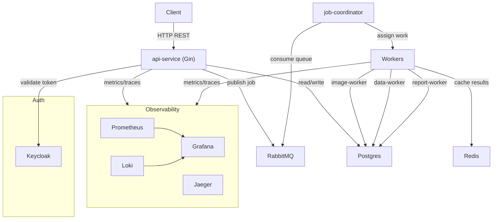

# Job Processing Platform - Full Build Plan

## Current State

The `/Users/amine/Developer/JPP` directory has **only 2 files** — `repoguide.md` (blueprint) and `JobProcessingPlatform_PRD.docx` (0 bytes, empty). Everything described in the guide must be created from scratch.

---

## System Architecture




---

## Phase 1 — Repository Scaffold (Day 1)

Create all root-level files and directory skeletons described in the guide.

**Files to create:**

- `README.md` — project overview and quick start
- `Makefile` — 30+ commands (setup, build, test, k8s, docker, observability, cleanup)
- `go.work` — Go workspace referencing all 6 modules
- `.gitignore` — Go, Docker, K8s patterns
- `CONTRIBUTING.md` — code conventions and worker addition guide
- `docs/` — 8 placeholder `.md` files (SETUP, ARCHITECTURE, LOCAL_DEV, K8S_CONCEPTS, OBSERVABILITY, API_REFERENCE, DEPLOYMENT, TROUBLESHOOTING)
- `.github/workflows/` — test.yml, build.yml, deploy.yml stubs

---

## Phase 2 — Backend Service Stubs (Days 2–3)

Each service is a standalone Go module. Create the module structure + stub `main.go` for each.

### `backend/shared/`

- `go.mod` (module: `github.com/jpp/shared`)
- `models.go` — core structs: `Job`, `JobStatus`, `JobType`, `WorkerResult`

### `backend/api-service/`

- `go.mod` (deps: Gin, GORM, amqp091-go, shared)
- `main.go` — Gin server, routes: `POST /jobs`, `GET /jobs/:id`, `GET /health`
- `handlers/`, `middleware/`, `config/`

### `backend/job-coordinator/`

- `go.mod`
- `main.go` — queue consumer loop, job assignment logic stub

### `backend/workers/image-worker/`, `data-worker/`, `report-worker/`

- Each: `go.mod` + `main.go` — RabbitMQ consumer, job execution stub, status update

```
backend/
├── shared/          models.go, go.mod
├── api-service/     main.go, go.mod, handlers/, config/
├── job-coordinator/ main.go, go.mod
└── workers/
    ├── image-worker/  main.go, go.mod
    ├── data-worker/   main.go, go.mod
    └── report-worker/ main.go, go.mod
```

---

## Phase 3 — Infrastructure (Days 3–4)

### Kind (Local K8s Cluster)

- `infra/kind/kind-config.yaml` — single node cluster, port mappings (8080, 5432, 5672, 15672)

### Kubernetes Manifests (`infra/k8s/`)

- `namespaces.yaml` — app, data, auth, observability
- `postgres/` — StatefulSet, PVC, Service, ConfigMap, Secret
- `redis/` — Deployment, Service
- `rabbitmq/` — StatefulSet (management plugin), Service, ConfigMap
- `keycloak/` — Deployment, Service, ConfigMap
- `services/` — Deployment + Service for each backend service (api-service, job-coordinator, 3 workers)
- `observability/` — Prometheus (ConfigMap with scrape config), Grafana, Loki, Jaeger

### Helm

- `infra/helm/job-platform/` — Chart.yaml, values.yaml, templates mirroring k8s manifests

### Scripts

- `scripts/setup.sh` — dependency checks (kind, kubectl, helm, docker, go), cluster creation, namespace setup
- `scripts/load-test.sh` — stub
- `scripts/chaos-test.sh` — stub
- `scripts/db/init.sql` — schema for jobs table

---

## Phase 4 — Core Job Flow Implementation (Week 2–3)

Build the actual job lifecycle end-to-end:

1. **API Service** — full job submission: validate request → write to Postgres → publish to RabbitMQ → return job ID
2. **Job Coordinator** — consume `jobs.pending` queue, route by `job_type` to typed queues
3. **Workers** — consume typed queues, execute stub logic, update job status in Postgres
4. **Retry logic** — dead-letter queue, exponential backoff on failure

Key data flow:

```
POST /jobs → Postgres (status=pending) → RabbitMQ (jobs.pending)
           → coordinator → RabbitMQ (jobs.image/data/report)
           → worker → Postgres (status=processing → completed/failed)
```

---

## Phase 5 — Observability (Week 5–7)

### Metrics (Prometheus + Grafana)

- Add `prometheus/client_golang` to each service
- Expose `/metrics` endpoint
- Custom metrics: `jobs_submitted_total`, `jobs_completed_total`, `job_processing_duration_seconds`, `queue_depth_gauge`
- Grafana dashboard JSON for job throughput and latency

### Logging (Loki + structured logs)

- Add `zerolog` or `zap` to all services
- JSON structured logs with `job_id`, `service`, `level`, `trace_id`
- Loki promtail config to scrape pod logs

### Tracing (Jaeger + OpenTelemetry)

- Add `go.opentelemetry.io/otel` SDK
- Instrument: HTTP handlers, RabbitMQ publish/consume, DB calls
- Propagate trace context across service boundaries

---

## Phase 6 — K8s Advanced + Production Readiness (Week 7–8)

- **HPA** — HorizontalPodAutoscaler for workers based on RabbitMQ queue depth (custom metric via Prometheus adapter)
- **Health checks** — liveness (`/healthz`) and readiness (`/readyz`) probes on all services
- **Resource requests/limits** — defined for all Deployments
- **Network Policies** — restrict inter-namespace traffic
- **RBAC** — ServiceAccount per service with minimum permissions
- **Pod Disruption Budgets** — for stateful services
- **CI/CD** — fill in GitHub Actions workflows: test on PR, build + push Docker images on merge, deploy to kind in CI

---

## Makefile Command Map


| Category      | Commands                                                                                                                                   |
| ------------- | ------------------------------------------------------------------------------------------------------------------------------------------ |
| Setup         | `make setup`, `make deps`                                                                                                                  |
| Build         | `make build`, `make build SERVICE=x`, `make docker-build-all`                                                                              |
| Test          | `make test`, `make lint`, `make fmt`                                                                                                       |
| K8s           | `make k8s-up`, `make k8s-deploy-all`, `make k8s-status`, `make k8s-logs SERVICE=x`, `make k8s-scale SERVICE=x REPLICAS=n`, `make k8s-down` |
| Observability | `make grafana-port-forward`, `make prometheus-port-forward`, `make jaeger-port-forward`                                                    |
| Cleanup       | `make clean`, `make clean-docker`                                                                                                          |


---

## 8-Week Timeline

- **Week 1** — Phase 1 + Phase 2 + Phase 3 scaffold (repo + stubs + infra files)
- **Week 2** — `make setup` working, cluster up, Postgres/Redis/RabbitMQ deployed
- **Week 3** — Full job lifecycle: API → queue → workers → status updates
- **Week 4** — K8s advanced: HPA, health checks, RBAC, NetworkPolicy
- **Week 5** — Prometheus metrics + Grafana dashboards live
- **Week 6** — Structured logging with Loki
- **Week 7** — Distributed tracing with Jaeger + OpenTelemetry
- **Week 8** — Chaos testing, production hardening, CI/CD finalized

---

## Starting Point

The first execution step scaffolds everything needed to run `make setup` and `make k8s-up`:

1. Root config files (Makefile, go.work, .gitignore, README)
2. All 6 Go service stubs with compilable `main.go`
3. All K8s manifests for data tier (Postgres, Redis, RabbitMQ, Keycloak)
4. `scripts/setup.sh` that checks deps and creates the kind cluster

